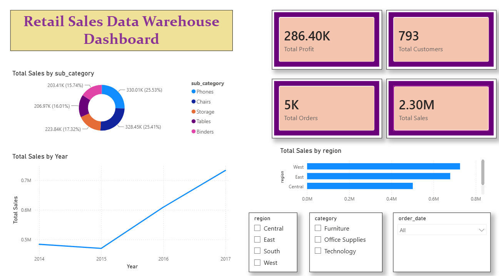

# Sales Data Warehouse Project

## Project Overview
Built a retail sales data warehouse using Python, PostgreSQL, SQL, and Power BI.

## Technologies Used
- Python
- PostgreSQL
- SQL
- Power BI
- Pandas
- psycopg2

## Workflow
1. Extract sales data from CSV
2. Load dimension tables
3. Load fact table
4. Perform SQL analytics
5. Build Power BI dashboard

## Dashboard Preview

## Author
Mohanish Bidkar
